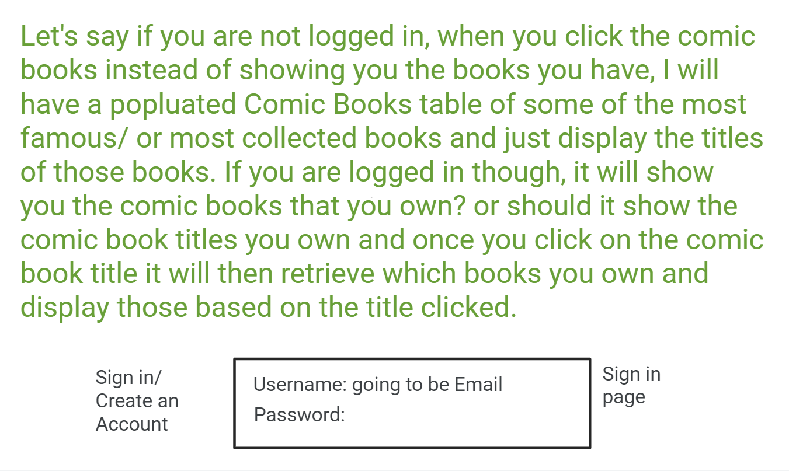
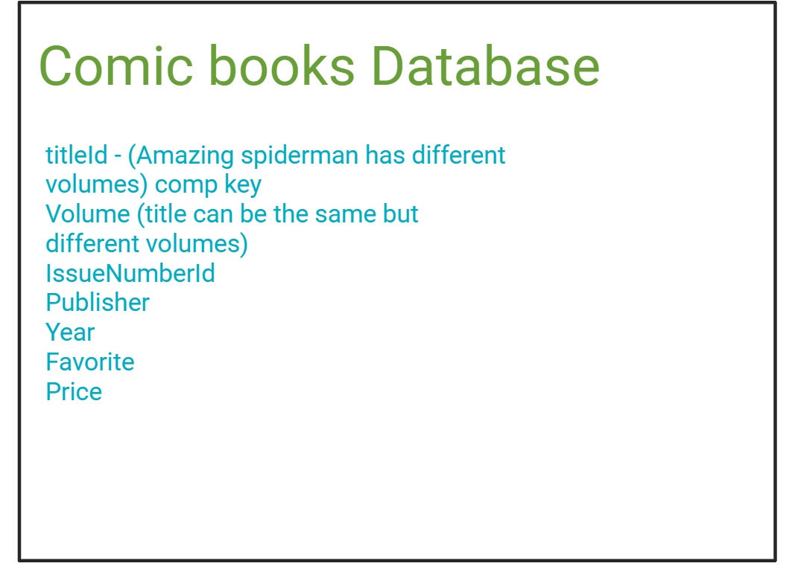

# Design Document

## _Collector's Stash_ Design

## 1. Problem Statement
Many individuals have a passion for collecting various and unique items, be it comic books, stamps, or other collectibles. They often resort to carrying physical notepads and books to manually document and keep track of their collections. This traditional method is overwhelming and can also be prone to errors, loss, and inefficiency. To address this issue, I am developing a innovative application aimed at providing collectors with a digital solution for managing and preserving their comic book collections.

## Top Questions to Resolve in Review
1. How many tables do I need?
2. Do I need to use a GSI (Let's say I use it so they can filter/search for their favorites or such)
3. What is the main goal vs the stretch goals, but clear on what the end goal looks like realistically

## Use Cases
u1. _As a user, I would like to be able to view the books in my collection_
u2. _As a user, I would like to favorite the books I like most_
U3. _As a user, I would like to view to store the price I paid for such book_
U5. _As a user, I would like to update my collection with new books or collectibles I have purchased_
U6. _As a user, I would like to update my collection, to get rid of books I might have sold off and no longer own_
U7. _As a user, I would like add a book to a new series I have started collecting_
U8. _As a user, I would like create an account_
U9 _As a user, I would like to login to my account_
U10. _As a user, I would like to see collection based of my login_

Stretch goals:
- Search Option
- Adding Images to the comics added(if wanted, user takes a picture and able to store that image)
- Better design on website

## Project Scope
- view books that have been added to my collection
- add books to a new series I am collection
- view all books in my collection

## Proposed Architecture Overview
We will use API Gateway and Lambda to create endpoints()
(GetAllComicBooksLambda, GetAllFavoriteLambda, GetAllStampsLambda, GetAllCoinsLambda, AddComicBookToCollectionLambda, AddStampsToCollectionLambda, AddCoinsToCollectionLambda, UpdateComicBookCollectionLambda, UpdateStampCollectionLambda, UpdateCoinCollectionLambda, SearchCollectionLambda)
_that will handle the creation, update, and retrieval of events and vendors to satisfy our requirements_

## API

## 6.1 Public Models
```
// ComicBookModel

String titleId
String volumeNumber
String issueNumber
String date
Int price
Boolean isFavorite
String publisher
```

## 6.2 _Get All Comic Books Endpoint_

_* Accepts `GET` requests to `/comicbooks/`
* Scans comics table and returns all ComicBookModels.
    * If no ComicBookTable is found
      `ComicBookNotFoundException`_


## 6.3 _Get One ComicBook Endpoint_

_* Accepts `GET` requests to `/comicbooks/:titleId/volumeNumber`
* Accepts a comicbook ID and volumeNumber returns the corresponding Comic Book Title.
    * If the given comicBook ID is not found or volumeNumber is not found, will throw a
      `ComicBookNotFoundException`_

## 6.4 _Add ComicBook Endpoint_

* Accepts `POST` requests to `/comicbook/titleId/volumeNumber/add`
* Accepts a comicbook ID and a ComicBookModel to be added.
    * If the comicBook can not be added to the comicBookTable, will throw an `UnableToAddToTableException`


## 6.5 _Update ComicBook Endpoint_

* Accepts `PUT` requests to, `/comicbook/:titleId/volumenumber`
    * If the given comicbook ID is not found and volumenumber, will throw a
      `ComicBookNotFoundException`_

## Tables
Comic Books
```
seriesTitle // partition key, string Batman
volumeNumber // sortkey, string 
issueNumber // string
date // string
price // int
isFavorite // boolean, sort key for GSI to find if favorite
publisher // string
```


comic book store locations

```
name // partition key, string
state // string
city // string
isFair // boolean, checking to see if they prices are fair or not/ sometimes i forget which comic stores i have been too

```

## Pages
  





